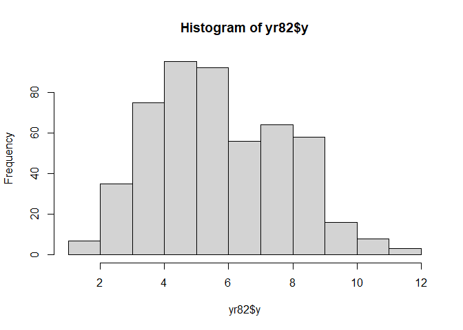
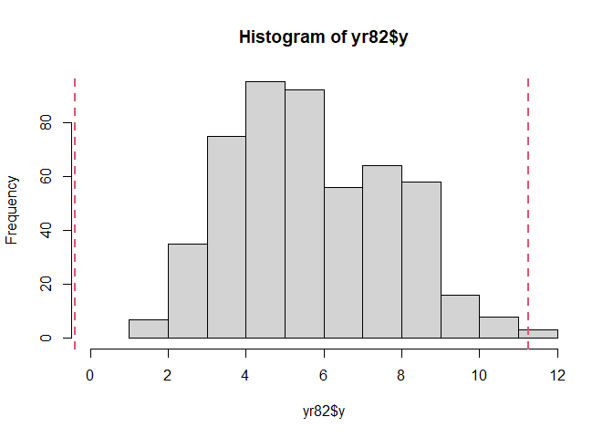
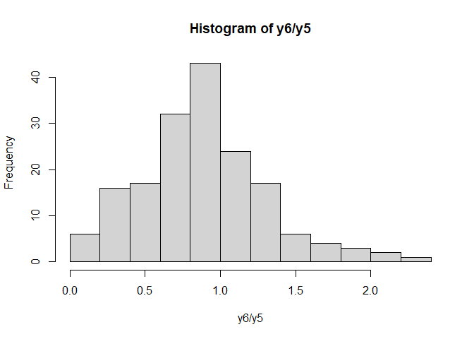
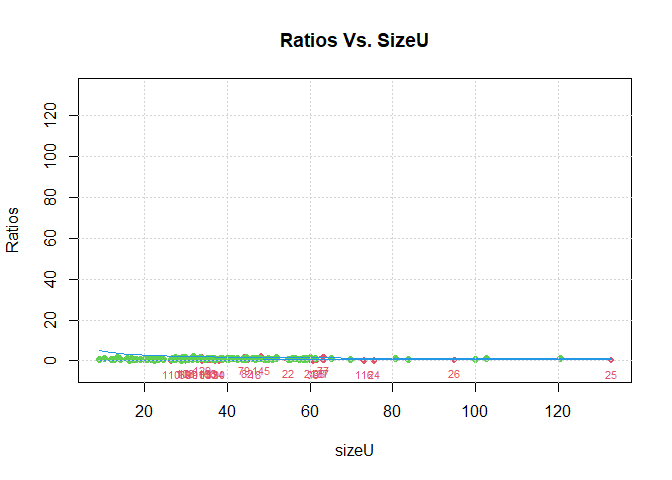
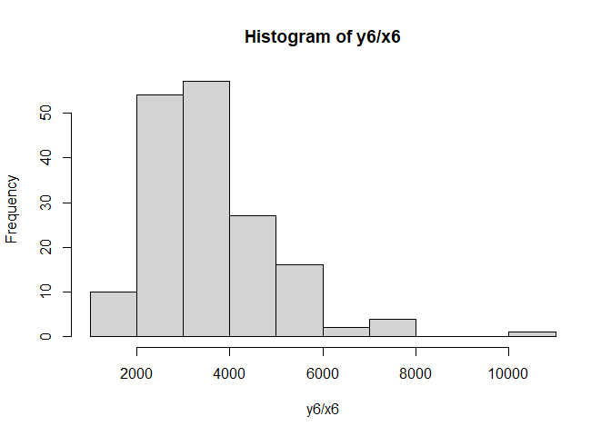

# R package univOutl
Marcello D’Orazio

# univOutl 

> **Detection of Univariate Outliers**

[](https://CRAN.R-project.org/package=univOutl)
[](https://CRAN.R-project.org/package=univOutl)[](http://www.awesomeofficialstatistics.org)

## 1. Introduction

The [**univOutl**](https://cran.r-project.org/package=univOutl) R
package provides a collection of functions for detecting outliers in
univariate (and bivariate) distributions using both parametric and
non‑parametric approaches. Below, we present the main functions
available in the package.

Additional resources, including **presentations and tutorials**, are
available
[here](https://github.com/marcellodo/univOutl/tree/master/Tutorials_OtherDocs).  

## 2. Parametric approach: data from Gaussian distribution

In the parametric case, it is assumed that the data come (approximately)
from a Gaussian distribution and that outliers are located at the tails
of the distribution, i.e. observations that fall outside an interval
constructed using robust parameter estimates (mean and standard
deviation). For this purpose, the reference function is `LocScaleB()`.
Here, the mean value is estimated using the median, while different
options are offered for achieving a robust estimate of the standard
deviation.

### Symmetric methods

These compute a single scale value `d`, giving bounds: `median ± k·d`

-   `method="MAD"`: uses Median Absolute Deviation:
    `d = median(|xᵢ − median(x)|) × 1.4826`

-   `method="IQR"`: uses Interquartile Range: `d = (Q3 − Q1) / 1.349`

-   `method="IDR"`: uses Interdecile Range: `d = (P90 − P10) / 2.5631`

-   `method="Gini"`: uses Gini Mean Difference: `d = GiniMD(x) / 2 × √π`

-   `method="Sn", "Qn", "ScaleTau"`: robust scale estimators from
    [**robustbase**](https://cran.r-project.org/package=robustbase)
    (Maechler et al., 2024), used directly as `d`

``` r
# install.packages("univOutl")
library(univOutl) # load the package
# install.packages("pder")
library(pder) #some dataset related to economic surveys
```

``` r
data(RDPerfComp) 
# data in year 1982
yr82 <- subset(RDPerfComp, year == 1982)
hist(yr82$y) # production (log transf.)
```



``` r
out.y <- LocScaleB(x = yr82$y, k = 2.5, method = "IQR")
```

    No. of outliers in left tail: 0

    No. of outliers in right tail: 1

``` r
out.y$bounds # bounds of the interval 
```

     lower.low   upper.up 
    -0.3946382 11.2559959 

``` r
out.y$outliers # position of outliers
```

    [1] 170

``` r
hist(yr82$y, xlim = c(0, 12)) 
abline(v = out.y$bounds, col = 2, lwd = 2, lty =2)
```



### Asymmetric methods

Some of the techniques in `LocScaleB()` (mainly those based on the
estimation of standard deviation using quantiles) enable the
identification of outliers when data exhibit a slightly skewed
distribution. In particular, it is possible to compute separate left and
right scales `d_L` and `d_R`, giving bounds: `median − k·d_L` and
`median + k·d_R`.

-   `method="DQ"`: Quartile-based: `d_L = (Q2 − Q1) / 0.6745`,
    `d_R = (Q3 − Q2) / 0.6745`

-   `method="DD"`: Decile-based: `d_L = (P50 − P10) / 1.2816`,
    `d_R = (P90 − P50) / 1.2816`

-   `method="adjout"`: Adjusted boxplot using the **MedCouple** (MC), a
    robust skewness measure. Fences adapted to the sign of MC:

If `MC ≥ 0`: `d_L = Q2 − Q1 + 1.5·exp(−4·MC)·(Q3−Q1)`,
`d_R = Q3 − Q2 + 1.5·exp(3·MC)·(Q3−Q1)`

If `MC < 0`: `d_L = Q2 − Q1 + 1.5·exp(−3·MC)·(Q3−Q1)`,
`d_R = Q3 − Q2 + 1.5·exp(4·MC)·(Q3−Q1)`

Both DQ and DD also report **Bowley’s skewness coefficient** as a
diagnostic, calculated as

-   with “DQ”: `B = [(Q3 − Q2) − (Q2 − Q1)] / (Q3 − Q1)`

-   with “DD”: `B = [(P90 − P50) − (P50 − P10)] / (P90 − P10)`

You can get an idea of the skewness of the data by calculating some of
the measures proposed in the literature and implemented in the
`skew.misc()` function in **univOutl**.

``` r
# skewness measures
skew.misc(x = yr82$y)
```

    The default of 'doScale' is FALSE now for stability;
      set options(mc_doScale_quiet=TRUE) to suppress this (once per session) message

      Pearson MedCouple  Bowley.Q       g.Q  Bowley.P       g.P 
    0.3178981 0.1503967 0.1738123 1.4207575 0.1617156 1.3858252 

``` r
# skewness based outlier detection
sout.y <- LocScaleB(x = yr82$y, k = 2.5, method = "dQ")
```

    Bowley's skewness coefficient is:  0.1738

    No outliers found

``` r
sout.y$bounds
```

     lower.low   upper.up 
     0.6178737 12.2685078 

``` r
range(yr82$y)
```

    [1]  1.243515 11.660980

Please note that `LocScaleB()` enables practitioners to apply survey
weights to outlier detection via the `weights` argument. Unfortunately,
this is only possible with some of the methods implemented in
`LocScaleB()` (see the corresponding help pages for more information).

## 3. Nonparametric approach: boxplot

The nonparametric search for outliers in univariate distributions is
based on the ideas underlying the boxplot. Outliers are identified as
observations in the tails of the distribution that fall outside the
boxplot *fences*. The central function is `boxB()`. The “standard” Tukey
boxplot assumes a symmetric distribution (no skewness; argument
`method = "resistant"`) (`k = 1.5` by default):

`lower = Q1 − k·IQR`, `upper = Q3 + k·IQR` where `IQR = Q3 − Q1`

``` r
# outlier detection via boxplot 
# standard boxplot
bby <- boxB(x = yr82$y, k = 1.5, 
            method = "resistant")
```

    No outliers found

``` r
bby$fences
```

         lower      upper 
    -0.5828276 11.9905367 

  
The `boxB()` function can be used to search for outliers in the presence
of slight or moderate skewness. In this latter case, the method is that
proposed by Hubert and Vandervieren (2008), which is also implemented in
the R function `adjboxStats()` in the **robustbase** (Maechler et al.,
2024) R package. This approach is considered valid if skewness, measured
via Medcoule, ranges on the interval \[-0.6, 06\] (medcouple = 0
indicates symmetry).

-   **`method = "asymmetric"`** — Kimber’s boxplot (forces `k = 1.5`):

<!-- -->

    lower = Q1 − 2*k·(Q2 − Q1), upper = Q3 + 2*k·(Q3 − Q2)

-   **`method = "asymmetric2"`** — Walker et al. (forces `k = 1.5`),
    skewness-adjusted via Bowley’s B:

    `lower = Q1 − 1.5·IQR·(1−B)/(1+B)`,
    `upper = Q3 + 1.5·IQR·(1+B)/(1−B)`

-   **`method = "adjbox"`** — Adjusted boxplot (forces `k = 1.5`),
    fences depend on MedCouple skewness MC:

    If `MC ≥ 0`: `lower = Q1 − 1.5·exp(−4·MC)·IQR`,
    `upper = Q3 + 1.5·exp(3·MC)·IQR`

    If `MC < 0`: `lower = Q1 − 1.5·exp(−3·MC)·IQR`,
    `upper = Q3 + 1.5·exp(4·MC)·IQR`

``` r
# adjusted boxplot for moderate skewness
mbby <- boxB(x = yr82$y, k = 1.5, 
             method = "adjbox")
```

    Warning in boxB(x = yr82$y, k = 1.5, method = "adjbox"): With method='adjbox'
    the argument k is set equal to 1.5

    The MedCouple skewness measure is: 0.1504

    No. of outliers in left tail: 3

    No. of outliers in right tail: 0

``` r
mbby$fences
```

        lower     upper 
     1.548634 14.678941 

``` r
mbby$outliers
```

    [1] 179 342 437

``` r
mbby$lowOutl # potential outliers in the left tail
```

    [1] 179 342 437

``` r
mbby$upOutl # potential outiers in the right tail
```

    integer(0)

Also supports `boxB()` uses od weights.

## 4. Detecting outliers with ratios of two variables

Although most of the functions in the package are dedicated to the
detection of univariate outliers, two functions can be used to handle
two variables by searching for outliers in the corresponding ratios.

#### 4.1 Data in panel surveys

When the same variable is observed repeatedly over time on the same set
of units Hidiroglou and Berthelot (1986) suggest to detect outliers
using the ratios $r_i = y_{i,t2}/y_{i,t1}$. They are initially centered
around the median ($r_M$):

$$
s_i = 1 - \frac{r_M}{r_i} \text{   } \text{if} \text{   } 0<r_i <r_M 
$$

$$
s_i=\frac{r_i}{r_M} - 1 \text{   } \text{if} \text{   } r_i \geq r_M
$$

and then multiplied by a factor proportional to the magnitude of the
largest value among those being compared (ratios involving higher values
are considered more ‘important’):

$$
E_i = s_i \times [max(y_{i,t1},y_{i,t2})]^U
$$

Bounds are then derived as:

$$ 
\text{lower} = E_M - C \cdot d_{Q1}, \qquad \text{upper} = E_M + C \cdot d_{Q3}
$$ where $$
d_{Q1} = max(E_M-E_{Q1}, |A \cdot E_M|), \qquad d_{Q3} = max(E_{Q3}-E_M, |A \cdot E_M|)
$$

being $E_{Q1}$, $E_M$ and $E_{Q3}$ the quartiles of the *E* scores. Note
that Hidiroglou and Émond (2018) suggest replacing the first and third
quartiles (Q1 and Q3) with the 10th and 90th percentiles (P10 and P90)
of the *E*-scores. This modification helps avoid the identification of
an excessive number of outliers, a situation that is likely when a large
proportion of units (more than one quarter) share the same ratio.

``` r
# outliers in ratios: Hidiroglou Berthelot method
# install.packages("plm")
data("RiceFarms", package = "plm")
# rice prod in year 6
y6 <- RiceFarms$noutput[seq(from = 6, to = 1026, by = 6)]
# rice prod in year 5
y5 <- RiceFarms$noutput[seq(from = 5, to = 1026, by = 6)]

hist(y6/y5)
```



``` r
hb.out <- HBmethod(yt1 = y5, yt2 = y6)
```

    MedCouple skewness measure of E scores: -0.1263

    Outliers found in the left tail: 22

    Outliers found in the right tail: 4

``` r
hb.out$bounds.E
```

          low        up 
    -44.10808  44.39336 

``` r
hb.out$outliers
```

     [1]  18  21  22  24  25  26  37  39  69  77  79  82  90  93  99 101 102 103 108
    [20] 110 116 129 134 138 145 168

``` r
# view scores 
hb.out <- HBmethod(yt1 = y5, yt2 = y6, 
                   return.dataframe = TRUE)
```

    MedCouple skewness measure of E scores: -0.1263

    Outliers found in the left tail: 22

    Outliers found in the right tail: 4

``` r
# potential outliers and scores (first 6)
head(subset(hb.out$data, outliers == 1))
```

       id   yt1  yt2     ratio     sizeU     Escore outliers
    18 18  2200  600 0.2727273  46.90416 -103.58001        1
    21 21  3600 1600 0.4444444  60.00000  -58.12500        1
    22 22  3000 1200 0.4000000  54.77226  -65.04205        1
    24 24  5700 1050 0.1842105  75.49834 -283.11879        1
    25 25 17610 5000 0.2839296 132.70268 -276.25379        1
    26 26  9000 4800 0.5333333  94.86833  -60.77502        1

``` r
# graphical view
bb <- plot4ratios(out = hb.out)
```



#### 4.2 Ratios of two variables

In general, the package offers the possibility of working with the ratio
of two distinct variables, $r_i=y_{i,t}/x_{i,t}$, which are observed in
the same survey at the same time. This approach works when the $Y$
variable is proportional to $X$ (i.e. “size”), e.g. turnover vs. number
of employees. The function is `ratioSize()` and it transforms the ratios
in a similar way to the Hidiroglou-Berthelot approach. However, it is
necessary to specify which variable denotes the “importance” of the
ratios (the denominator or another variable). Unlike the HB method,
outlier identification is based on an adjusted boxplot for a skewed
distribution (Hubert & Vandervieren, 2008).

``` r
# size of rice plots in year 6
x6 <- RiceFarms$size[seq(from = 6, to = 1026, by = 6)]

hist(y6/x6)
```



``` r
rt.out <- ratioSize(numerator = y6, 
                    denominator = x6, 
                    size = x6, U = 0.5) 
```

    MedCouple skewness measure of centerad ratios: 0.1837

``` r
rt.out$bounds
```

    [1] -0.5008782  1.4541716

``` r
rt.out$outliers
```

     [1] 146  53 144  18 163 170  61  38  86  30 139  32  65 110

``` r
# view details
rt.out <- ratioSize(numerator = y6, 
                    denominator = x6, 
                    size = x6, U = 0.5, 
                    return.dataframe = TRUE) 
```

    MedCouple skewness measure of centerad ratios: 0.1837

``` r
head(subset(rt.out$data, outliers == 1))
```

         id numerator denominator     ratio    c.ratio outliers     sizeU
    146 146      1250       0.574  2177.700 -0.5114240        1 0.7576279
    53   53       992       0.557  1780.969 -0.8481106        1 0.7463243
    144 144       850       0.429  1981.352 -0.6612034        1 0.6549809
    18   18       600       0.357  1680.672 -0.9584000        1 0.5974948
    163 163      2700       0.249 10843.373  2.2944277        1 0.4989990
    170 170       400       0.243  1646.091 -0.9995429        1 0.4929503

The function returns centered ratios along with their corresponding
*importance* values, enabling the identification of outliers in the
ratios using any of the methods available in the package.  

## References

Hidiroglou, M.A. and Berthelot, J.-M. (1986) ‘Statistical editing and
Imputation for Periodic Business Surveys’. *Survey Methodology*, Vol 12,
pp. 73-83.

McGill, R., Tukey, J. W. and Larsen, W. A. (1978) ‘Variations of box
plots’. *The American Statistician*, 32, pp. 12-16.

Rousseeuw, P.J. and Croux, C. (1993) ‘Alternatives to the Median
Absolute Deviation’, *Journal of the American Statistical Association*
88, pp. 1273-1283.

Hubert, M., and Vandervieren, E. (2008) ‘An Adjusted Boxplot for Skewed
Distributions’, *Computational Statistics & Data Analysis*, 52,
pp. 5186-5201.

Maechler, M., Rousseeuw, P., Croux, C., Todorov, V., Ruckstuhl, A.,
Salibian-Barrera, M., Verbeke, T., Koller, M., c(“Eduardo”, “L. T.”)
Conceicao and di Palma M.A, (2024). *robustbase: Basic Robust
Statistics* R package version 0.99-4-1. URL
<http://CRAN.R-project.org/package=robustbase>
